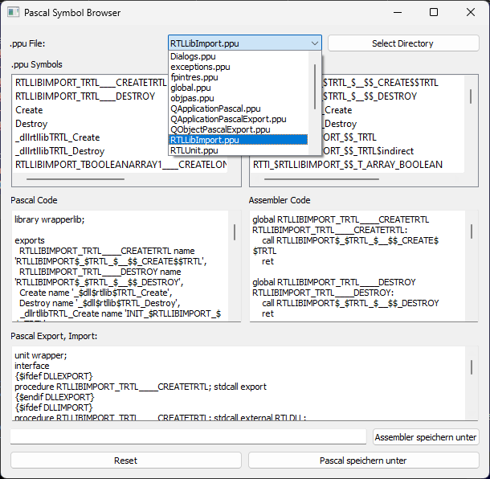

This directory contains pascal source files to create a .dll and .exe for Microsoft Windows 10/11 64-Bit Operating Systems. 
Fully based on pre-working tasks by @fibonacci. 

Currently, it will be used for private use by @fibodev and @paule32 for minimize the code base of FPC Application's.

1. to compile this test project part you would need to download, and install the Mingw64-Bit Environment System which comes with a wide range of **POSIX** like helper tools such as **SED**, and so on
2. you need a working copy of fpc.exe and nasm.exe
3. clone this repro or download the zip package
4. depack the zip package into your developer directory
5. to compile all, simply start the batch file **build.bat** that comes with the source tree.
6. eventually you need to update the Path's of fpc.exe and nasm.exe within the batch file **build.bat**
7. I all works, you will have a **rtllib.dll** and **test.exe** in your file system

Some notes:
- test_unit.pas will compile to test_unit.s
- test_unit.s will "sed" to remove some not needed stuff (debug)
- then test_unit.s will assembled with nasm.exe to test_unit.o
- then the batch file calls fpc.exe to form exe file

- the test_unit.o file is embeeded into test.pas per {$L test_unit.o} to call DLL function

some Tools:

